<p align="center">
  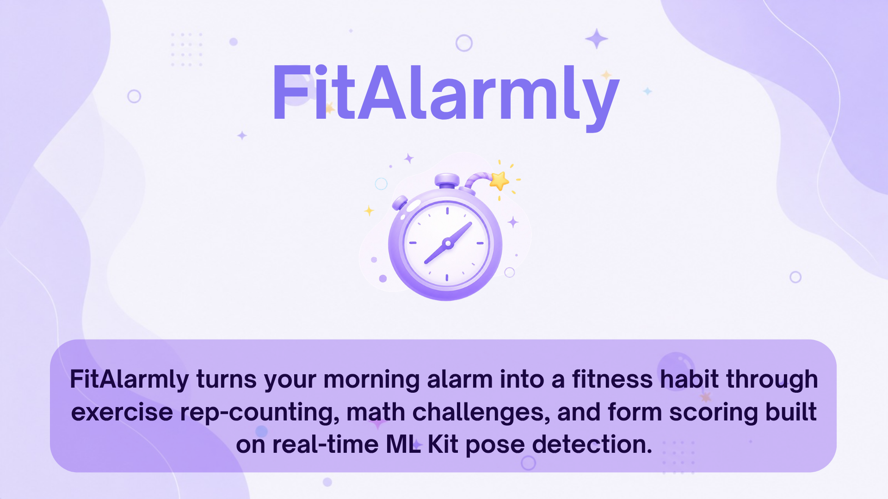
</p>

<h1 align="center">FitAlarmly</h1>

<p align="center">
  An alarm clock you dismiss with push-ups or math — it won't let you snooze.
</p>

<p align="center">
  
  
  
  
</p>

## Contents

- [The Problem](#the-problem)
- [Our Solution](#our-solution)
- [App Screens](#app-screens)
- [Features](#features)
- [How Rep Counting Works](#how-rep-counting-works)
- [Tech Stack](#tech-stack)
- [Project Structure](#project-structure)
- [Getting Started](#getting-started)
- [Available Scripts](#available-scripts)
- [Permissions](#permissions)
- [Notes](#notes)

---

## The Problem

<p align="center">
  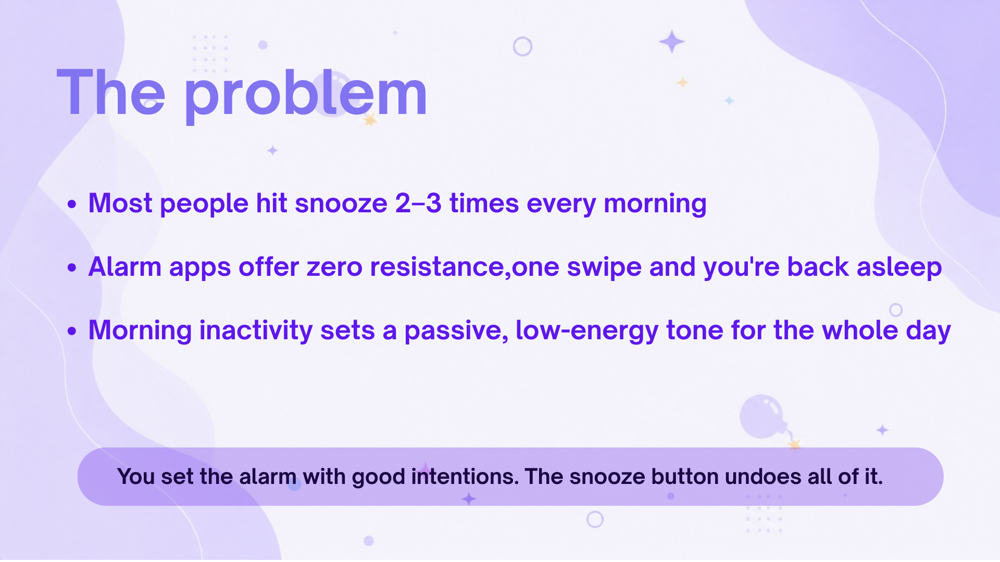
</p>

Most people hit snooze 2–3 times every morning. Alarm apps offer zero resistance — one swipe and you're back asleep. Morning inactivity sets a passive, low-energy tone for the whole day.

---

## Our Solution

<p align="center">
  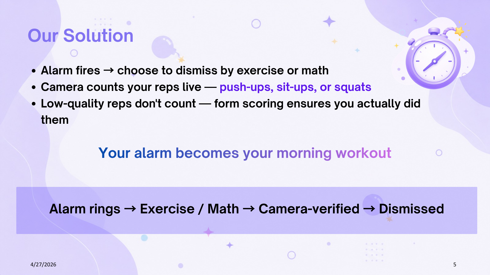
</p>

FitAlarmly turns your morning alarm into a fitness habit through **exercise rep-counting, math challenges, and form scoring** built on real-time ML Kit pose detection.

`Alarm rings → do an exercise (camera-counted) or solve math → alarm stops`

---

## App Screens

### Home Screen

<p align="center">
  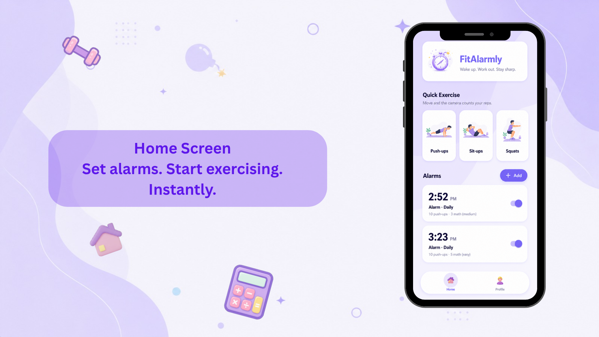
</p>

Set alarms with a dismiss challenge, or jump straight into a Quick Exercise set. Each alarm shows its time, repeat schedule, and configured dismiss rule at a glance.

---

### Exercise Screen

<p align="center">
  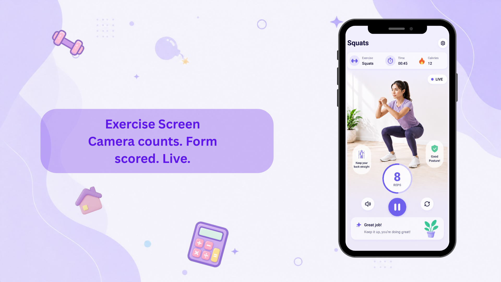
</p>

The camera counts your reps live. Form hints appear in real time, and a rep only counts if it passes the scoring threshold — you can't fake it.

---

### Math Dismiss Screen

<p align="center">
  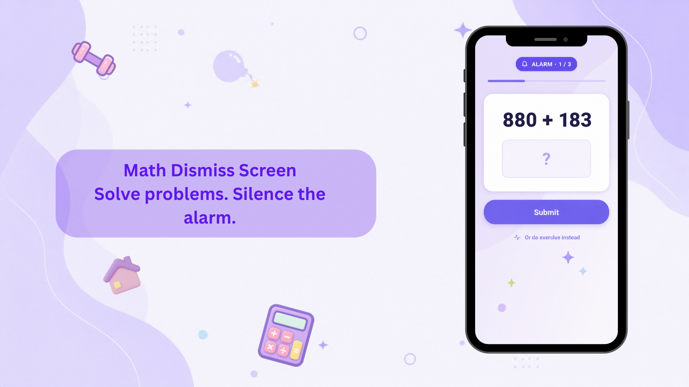
</p>

Solve a configurable number of arithmetic problems to dismiss the alarm. Three difficulty levels ensure the challenge matches your preference. You can also switch to exercise mid-session.

---

## Features

- **Set alarms** — scrollable 12-hour time wheels, a label, and repeat (Once / Daily / specific weekdays).
- **Native alarm** — `AlarmManager`-scheduled, fires when the app is closed or the screen is locked, rings continuously via a foreground service until dismissed, and re-arms after reboot.
- **Dismiss by exercise** — pick push-ups, sit-ups or squats; the camera counts your reps (front/back, flippable) and stops the alarm at the target count.
- **Dismiss by math** — solve N problems. Difficulty:
  - **Easy** — two 2-digit numbers, `+ / −` only (e.g. `22 + 57`)
  - **Medium** — 50% 2-digit, 40% 3-digit `+ / −`, 10% `× / ÷` of 2-digit numbers
  - **Hard** — 60% 3-digit `+ / −`, 10% 2-digit `+ / −`, 30% `× / ÷` of 2-digit numbers
- **Quick Exercise** — start a camera-counted set any time from the home screen.
- **Stats** — total reps, calories burned, workouts completed, a per-exercise breakdown, and a selectable avatar.

---

## How Rep Counting Works

### Why It's Hard

<p align="center">
  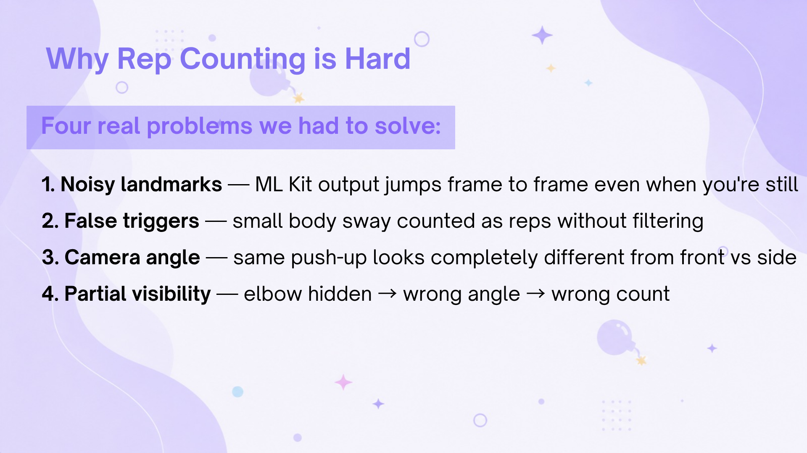
</p>

### Why Google ML Kit

<p align="center">
  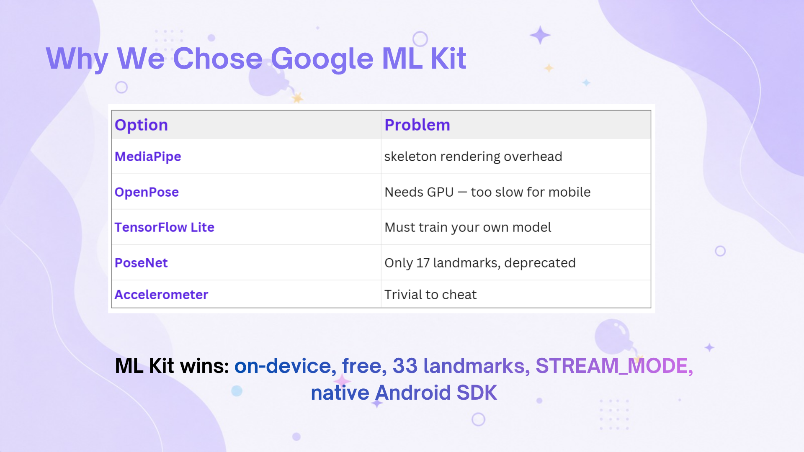
</p>

Each camera frame runs through a five-stage pipeline on a native thread:

```
Camera frame (native thread)
     ↓
Google ML Kit — 33 body landmarks at ~30 fps
     ↓
Joint-angle calculation — from 3 landmarks
     ↓
Signal smoothing — spike rejection + EMA filter
     ↓
State machine — IDLE → DOWN → UP → rep counted (debounced)
     ↓
Scoring — depth / form / stability / tempo (low-quality reps don't count)
```

### How Errors Are Minimised

<p align="center">
  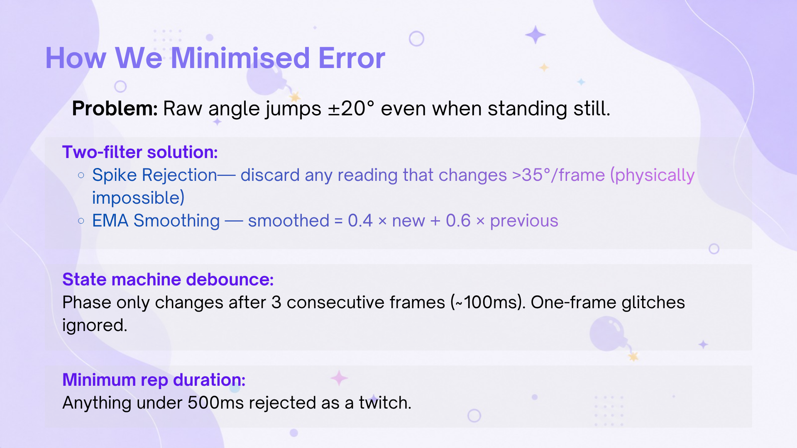
</p>

### Camera Angle Detection

<p align="center">
  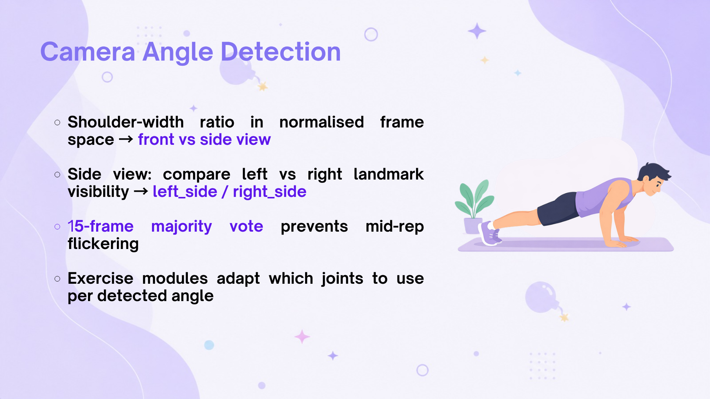
</p>

The app auto-detects whether the camera is facing front or side using shoulder-width ratio in normalised frame space. A 15-frame majority vote prevents mid-rep flickering. Each exercise module then selects the correct joints for the detected angle.

### Rep Scoring System

<p align="center">
  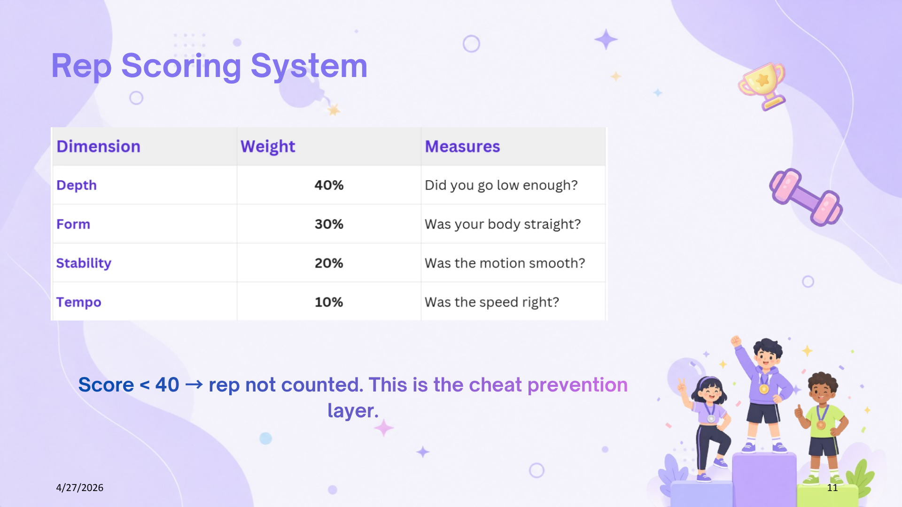
</p>

### Accuracy Bottlenecks

<p align="center">
  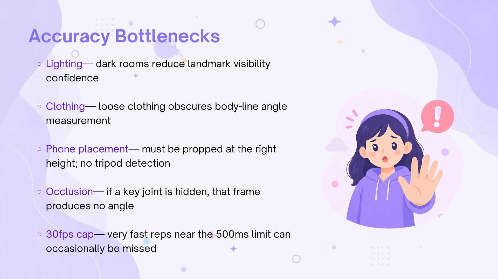
</p>

---

## Tech Stack

| Layer | Technology |
|---|---|
| App framework | React Native CLI `0.74` |
| Language | TypeScript |
| Camera + frame processing | `react-native-vision-camera` v4 + `react-native-worklets-core` |
| Pose detection | Google ML Kit Accurate Pose (Kotlin native frame processor) |
| Alarm | Custom Kotlin module: `AlarmManager` + full-screen notification + foreground service + boot receiver |
| State | Zustand, persisted with AsyncStorage |
| Navigation | React Navigation (native stack) |

---

## Project Structure

```
SystemProject/
├── android/app/src/main/java/com/fitcounter/
│   ├── alarm/             # AlarmModule, AlarmScheduler, AlarmReceiver,
│   │                      # AlarmService, BootReceiver, AlarmRepeat, AlarmStorage
│   └── posedetection/     # ML Kit pose-detection frame-processor plugin
├── src/
│   ├── App.tsx            # navigation, alarm-fired routing, store hydration
│   ├── screens/           # Home, Stats, Exercise, Summary, AlarmSetup,
│   │                      # AlarmRing, DismissExercise, MathProblem
│   ├── components/        # CameraView, FormGlow, SuccessOverlay, ui/*
│   ├── core/              # rep-counting engine (state machine, scoring, exercises/*)
│   ├── store/             # alarmStore, statsStore, avatarStore, exerciseStore
│   ├── utils/             # mathGenerator, constants
│   └── theme/             # design tokens
└── Elements/              # image assets
```

---

## Getting Started

### Prerequisites

- Node.js 18+
- JDK 17
- Android Studio with the Android SDK (compileSdk 34)
- An Android device or emulator (the release build ships **arm64-v8a**)

### Run (debug)

```bash
npm install
npm run android
```

### Build a Release APK

A release keystore (`android/app/fitcounter-release.keystore`) is already configured.

```bash
cd android

# all ABIs
./gradlew assembleRelease

# slim single-ABI build for modern phones (~60 MB)
./gradlew assembleRelease -PsingleAbi -PreactNativeArchitectures=arm64-v8a
```

Output: `android/app/build/outputs/apk/release/app-release.apk`

```bash
adb install -r android/app/build/outputs/apk/release/app-release.apk
```

---

## Available Scripts

| Command | Purpose |
| --- | --- |
| `npm run start` | Start the Metro bundler |
| `npm run android` | Build and launch the Android app |
| `npm run test` | Run the Jest test suite |
| `npm run lint` | Run ESLint over the TypeScript source |

---

## Permissions

`CAMERA`, `POST_NOTIFICATIONS`, `VIBRATE`, `WAKE_LOCK`, `USE_EXACT_ALARM`,
`SCHEDULE_EXACT_ALARM`, `USE_FULL_SCREEN_INTENT`, `RECEIVE_BOOT_COMPLETED`,
`FOREGROUND_SERVICE` / `FOREGROUND_SERVICE_MEDIA_PLAYBACK`.

Grant the notification permission on first launch so alarms can show their full-screen ring.

---

## Notes

- **Android only** — the native alarm (lock-screen ring, exact scheduling, boot persistence) has no iOS counterpart in this project.
- The alarm uses the device's default alarm tone.
- The Android package id remains `com.fitcounter` (internal id only; the app name is FitAlarmly).
